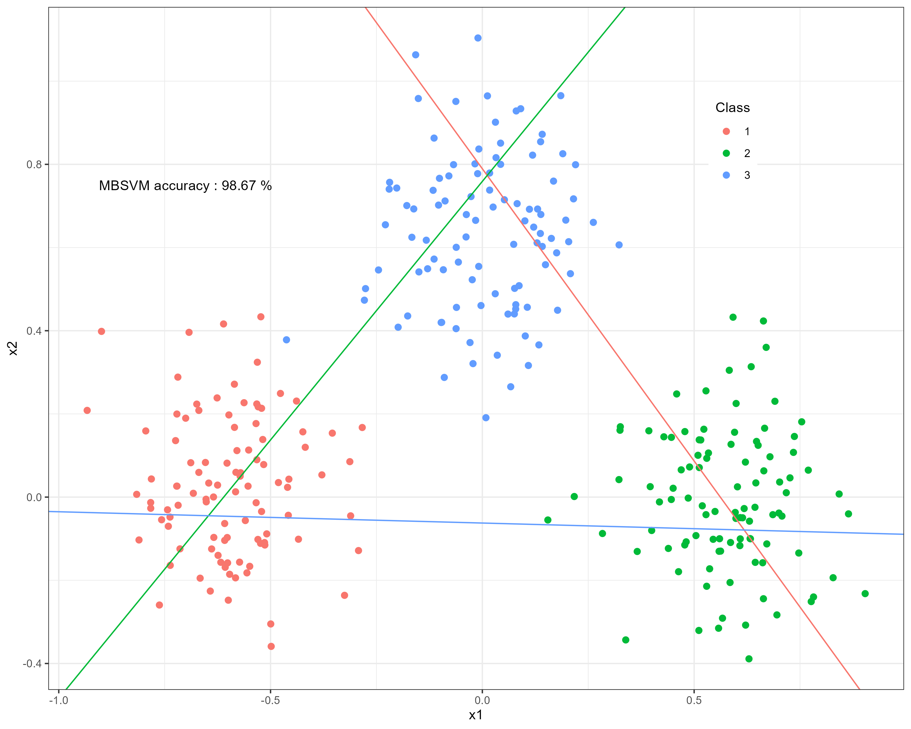

# many SVMs



## Introduction

There are many different types of SVMs in this repository. 

**why I created this project ?**

In order to learn `SVMs` better, I built this repository to implement support vector machines.

## How to install manysvms

First set the working path of `R` to the project folder, and then run the following command:

```{r}
devtools::install_github('define957/manysvms')
```

## SVMs

+ Twin-SVM for binary classification
+ Twin-SVM for Multi-classification (Ones versus All strategy) 
+ Twin-SVM for Multi-classification (Ones versus All strategy and K-fold cross validation) 
+ Multiple Birth SVM for Multi-classification

## Development environment and dependency

R Version : 4.2.1

## Contact us

Email : zhangjiaqi957957@outlook.com

## Licenses

GNU GENERAL PUBLIC LICENSE Version 3 (GPL-3.0)
