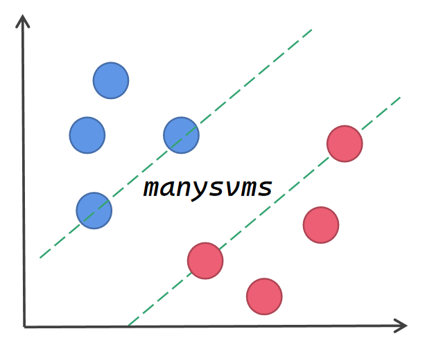

# **manysvms** 
             


***


## Introduction

There are many different types of SVMs in this repository. 

## Organization structure

<div align=center></div>

## Why I created this project ?

In order to learn `SVMs` better, I built this repository to implement support vector machines. The package is under active development.

## How to install manysvms

Make sure you have installed `devtools`, if you don't have `devtools` installed, please run the following command first 
```{r}
install.packages("devtools")
```
After you installed `devtools`, please run the following command :
```{r}
devtools::install_github("define957/manysvms")
```
Then you can have `manysvms` package on your PC。
## Important notice
The refactoring of the project is complete !!!

## SVMs for classification

+ Hinge Loss Support Vector Classification
+ Pinball Loss Support Vector Classification
+ Least Squares Loss Support Vector Classification
+ Rescaled Quantile Loss Support Vector Classification
+ Sigmoid Loss Support Vector Classification
+ Blinex Cost Sensitive Support Vector Classification
+ QTLS Support Vector Classification

## SVMs for regression


## Kernel options

+ Linear kernel
+ RBF kernel
+ Polynomial kernel

## Development environment and dependency

My enviroment: R 4.3.0, windows 11 x64 &#x2705;

Other test environment detail: 
+ Windows 10/11 x64 &#x2705;
+ Mac osx (ARM platform) &#x2705; 
+ Linux : We haven't tested it yet &#x2753;

Dependency: 

+ foreach
+ doParallel
+ doSNOW

## Bug report

If you find bug in this package, please post an issue on the [issue](https://github.com/define957/manysvms/issues) website.

## Contact us

&#x2709; Email : zhangjiaqi957957@outlook.com

## Licenses

GNU GENERAL PUBLIC LICENSE Version 3 (GPL-3.0)